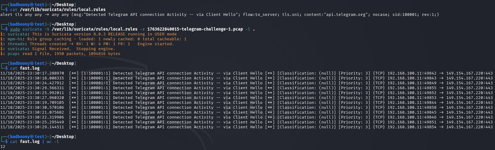

### detectionstream suricata/sigma rule chal

**suricata chal:** Detect Telegram API connection Activity
- **goal:** Create a rule that will detect the packets related to the telegram API communication.

**rule:** `alert tls any any -> any any (msg:"Detected Telegram API connection Activity -- via Client Hello"; flow:to_server; tls.sni; content:"api.telegram.org"; nocase; sid:100001; rev:1;)`

**Thoughts:** It’s as simple as targeting tls.sni, the Server Name Indication. I originally included the JA3 hash, but realized that it wasn’t helpful for detecting Telegram connection activity. JA3 fingerprints the client TLS handshake, not the destination (api.telegram.org). Adding a JA3 hash for detection would focus on the TLS client implementation rather than Telegram API traffic itself. JA3 is more useful when detecting unusual client behavior, malware-y stuff, where the TLS fingerprint is unique enough to identify a specific malicious tool or a specific TLS client implementation.

- ja3 == destination-independant
- SNI == more direct and reliable indicator

The chal expected detection of 12 packets:

**suricata chal:** Identify Speech Recognition Chrome Extension Payload in Network Traffic
- **goal:** Analyze the captured traffic and determine whether a Chrome extension payload is being transferred. Focus on response content that reveals the extension’s manifest and embedded DLL components, and write a Suricata rule that detects this artifact reliably without relying on IPs or ports.

- **rule:** '------'

**Thoughts:** 
